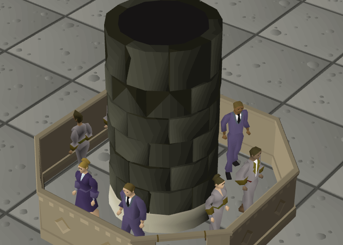
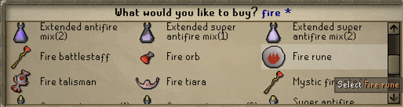
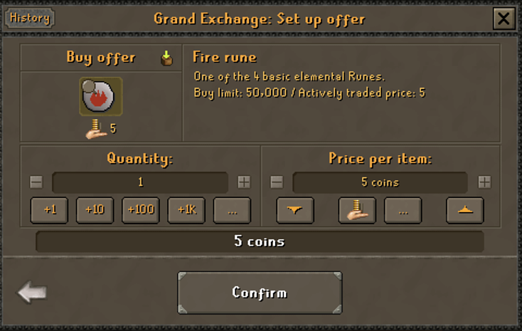
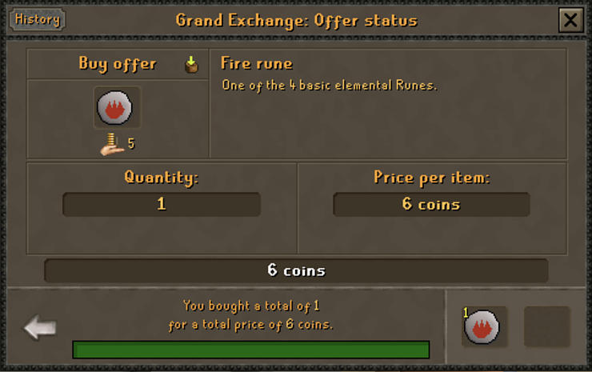
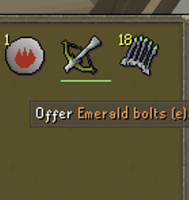
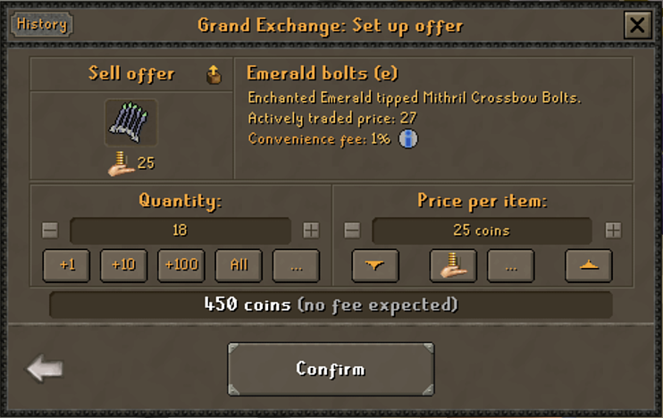
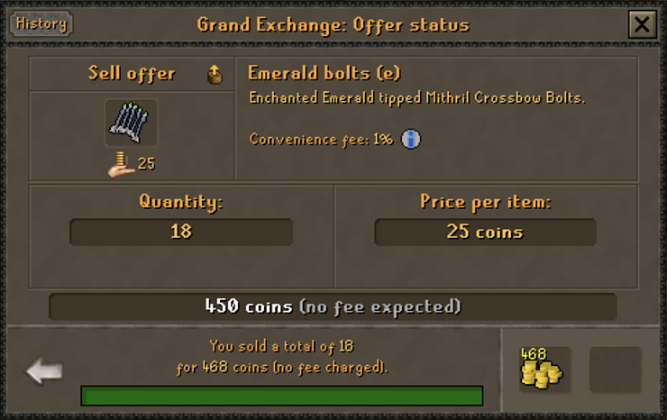
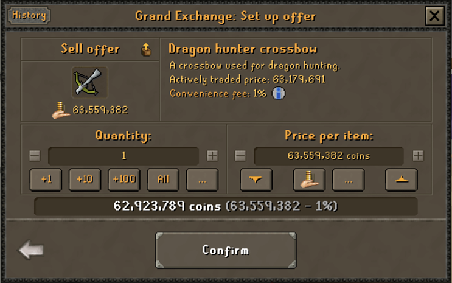
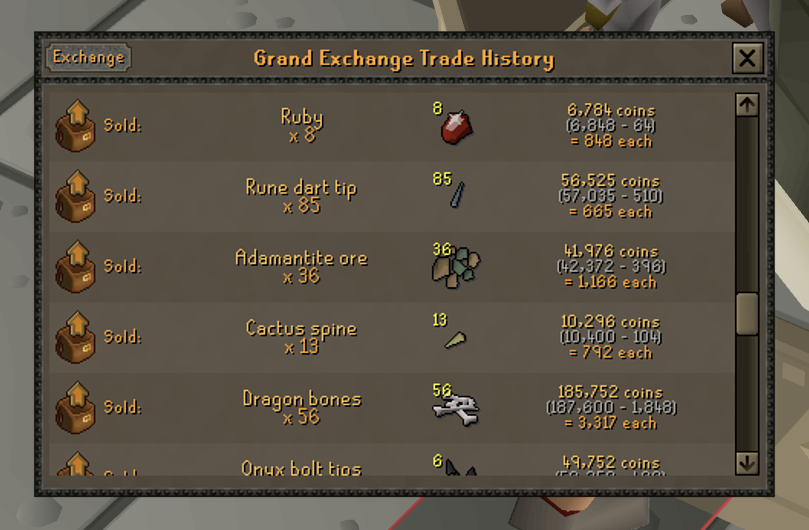

# Grand Exchange Basics

## Buying

Here the user is searching the exchange for items to buy.

After selecting an item, they are taken to this screen. Here they can select the quantity and price per item.

After the offer is placed, this screenshot shows the outcome of the user successfully buying an item.

## Selling

The user must select *offer* in their inventory to sell a certain item.

Similarly to buying, this interface for selling allows the user to specifyf the quantity and minimum price per item.

Here the sell offer has been placed and successfuly went through.

## Tax

For some items that are over 100gp, there is a tax. In this example, when selling the 63.5m gp item, the seller will only receive 62.9m gp.

## Trade History

Players can view their own trade history. Here is a snippet of my trade history from a few days ago when I sold all my rewards from bossing for a few hours.
