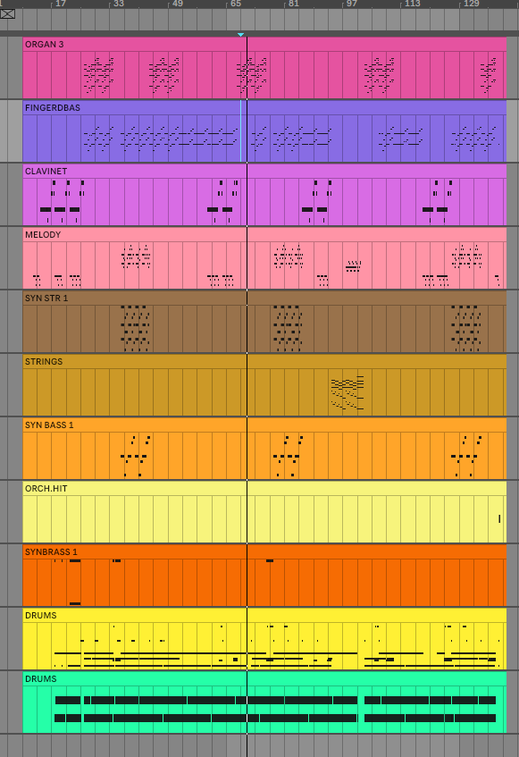

# general notes

* this is going to be a place for me to put some in-the-moment notes before i eventually categorize them and log them
* <https://github.com/asigalov61/Tegridy-MIDI-Dataset>
  * good dataset for midi files before i apply to receive the bigger dataset
  * This repo also recommend ALOT of other datasets to have
    * Los Angeles MIDI Dataset <https://github.com/asigalov61/Los-Angeles-MIDI-Dataset>
    * Meta MIDI Dataset <https://github.com/jeffreyjohnens/MetaMIDIDataset>
    * LAKH MuseNet MIDI Dataset <https://github.com/asigalov61/LAKH-MuseNet-MIDI-Dataset>
    * LAKH MIDI Dataset <https://colinraffel.com/projects/lmd/>
    * ATEPP Solo Piano MIDI Dataset <https://github.com/BetsyTang/ATEPP>
    * GiantMIDI Dataset <https://github.com/bytedance/GiantMIDI-Piano>
    * Rock-Piano MIDI Dataset <https://github.com/asigalov61/Rock-Piano-MIDI-Dataset>
    * MAESTRO Dataset <https://magenta.tensorflow.org/datasets/maestro>
    * adl-piano Dataset <https://github.com/lucasnfe/adl-piano-midi>
    * POP909 Dataset <https://github.com/music-x-lab/POP909-Dataset>
    * POP1k7 Dataset <https://github.com/YatingMusic/compound-word-transformer>
    * Nottingham Dataset <https://github.com/jukedeck/nottingham-dataset>
    * ASAP Dataset <https://github.com/fosfrancesco/asap-dataset>
    * lead-sheet Dataset <https://github.com/wayne391/lead-sheet-dataset>

The Los-Angeles-MIDI-Dataset is filled with multi-track midi files! 